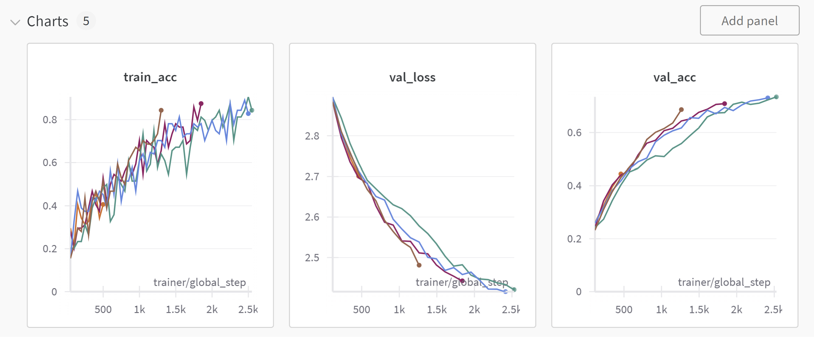
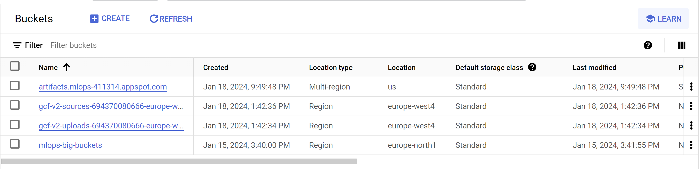
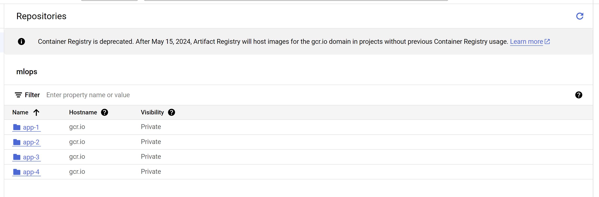
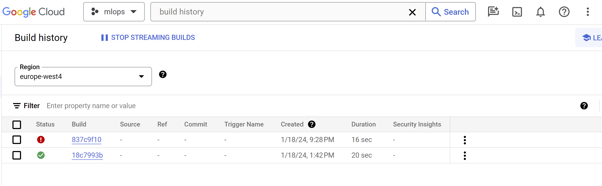
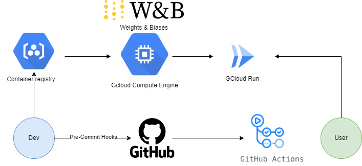

# Exam template for 02476 Machine Learning Operations

This is the report template for the exam. Please only remove the text formatted as with three dashes in front and behind
like:

```--- question 1 fill here ---```

where you instead should add your answers. Any other changes may have unwanted consequences when your report is auto
generated in the end of the course. For questions where you are asked to include images, start by adding the image to
the `figures` subfolder (please only use `.png`, `.jpg` or `.jpeg`) and then add the following code in your answer:

```markdown

```

In addition to this markdown file, we also provide the `report.py` script that provides two utility functions:

Running:

```bash
python report.py html
```

will generate an `.html` page of your report. After deadline for answering this template, we will autoscrape
everything in this `reports` folder and then use this utility to generate an `.html` page that will be your serve
as your final handin.

Running

```bash
python report.py check
```

will check your answers in this template against the constrains listed for each question e.g. is your answer too
short, too long, have you included an image when asked to.

For both functions to work it is important that you do not rename anything. The script have two dependencies that can
be installed with `pip install click markdown`.

## Overall project checklist

The checklist is *exhaustic* which means that it includes everything that you could possible do on the project in
relation the curricilum in this course. Therefore, we do not expect at all that you have checked of all boxes at the
end of the project.

### Week 1

* [x] Create a git repository
* [x] Make sure that all team members have write access to the github repository
* [x] Create a dedicated environment for you project to keep track of your packages
* [x] Create the initial file structure using cookiecutter
* [x] Fill out the `make_dataset.py` file such that it downloads whatever data you need and
* [x] Add a model file and a training script and get that running
* [x] Remember to fill out the `requirements.txt` file with whatever dependencies that you are using
* [x] Remember to comply with good coding practices (`pep8`) while doing the project
* [x] Do a bit of code typing and remember to document essential parts of your code
* [x] Setup version control for your data or part of your data
* [x] Construct one or multiple docker files for your code
* [x] Build the docker files locally and make sure they work as intended
* [x] Write one or multiple configurations files for your experiments
* [ ] Used Hydra to load the configurations and manage your hyperparameters
* [x] When you have something that works somewhat, remember at some point to to some profiling and see if
      you can optimize your code
* [x] Use Weights & Biases to log training progress and other important metrics/artifacts in your code. Additionally,
      consider running a hyperparameter optimization sweep.
* [x] Use Pytorch-lightning (if applicable) to reduce the amount of boilerplate in your code

### Week 2

* [x] Write unit tests related to the data part of your code
* [x] Write unit tests related to model construction and or model training
* [ ] Calculate the coverage.
* [x] Get some continuous integration running on the github repository
* [ ] Create a data storage in GCP Bucket for you data and preferable link this with your data version control setup
* [ ] Create a trigger workflow for automatically building your docker images
* [x] Get your model training in GCP using either the Engine or Vertex AI
* [x] Create a FastAPI application that can do inference using your model
* [ ] If applicable, consider deploying the model locally using torchserve
* [x] Deploy your model in GCP using either Functions or Run as the backend

### Week 3

* [ ] Check how robust your model is towards data drifting
* [ ] Setup monitoring for the system telemetry of your deployed model
* [ ] Setup monitoring for the performance of your deployed model
* [ ] If applicable, play around with distributed data loading
* [ ] If applicable, play around with distributed model training
* [ ] Play around with quantization, compilation and pruning for you trained models to increase inference speed

### Additional

* [x] Revisit your initial project description. Did the project turn out as you wanted?
* [x] Make sure all group members have a understanding about all parts of the project
* [x] Uploaded all your code to github

## Group information

### Question 1
> **Enter the group number you signed up on <learn.inside.dtu.dk>**
>
> Answer:

85
### Question 2
> **Enter the study number for each member in the group**
>
> Example:
>
> *sXXXXXX, sXXXXXX, sXXXXXX*
>
> Answer:

s214640, 2174159
### Question 3
> **What framework did you choose to work with and did it help you complete the project?**
>
> Answer length: 100-200 words.
>
> Example:
> *We used the third-party framework ... in our project. We used functionality ... and functionality ... from the*
> *package to do ... and ... in our project*.
>
> Answer:

Apart from implementing Pytorch-Lightning and coupling it to Weights and Biases, we did not make heavy use of a third party framework.
We did, however, make use of for instance Pillow to load the image in out deployed app. This greatly helped as without it we
would have to implement our own image loader.

## Coding environment

> In the following section we are interested in learning more about you local development environment.

### Question 4

> **Explain how you managed dependencies in your project? Explain the process a new team member would have to go**
> **through to get an exact copy of your environment.**
>
> Answer length: 100-200 words
>
> Example:
> *We used ... for managing our dependencies. The list of dependencies was auto-generated using ... . To get a*
> *complete copy of our development environment, one would have to run the following commands*
>
> Answer:

We made use of a *requirements* file for managing dependencies.
Neither group memer utilized anaconda, so we each made a virtual enviroment using the build in package from python. Both users utilized
python 3.10.11, as the newest version of python 3.10.X from the official python website.
When adding a new package to the project we each ensured to add it to the *requirements* file.
If required, a specific version was specified of the dependency within the *requirements file*.

In order to obtain a complete copy of the enviroment one would have to do the following:
1. Install python 3.10.11, make sure to add the executable to PATH.
2. ```python -m venv <env-name>```
3. Activate the new enviroment: ```<env-name>/Scripts/activate``` if utilizing windows or ```<env-name>/bin/activate``` for Mac OS / Linux cmd line.
4. Install the required dependencies: ```pip install -r requirements.txt```, assuming the user is in the root folder of the project

If the user is running Anaconda or Miniconda, the following commands should be used:
1. ```conda create -n <env-name> python=3.10.11```
2. ```conda activate <env-name>```
3. ```pip install -r requirements.txt```

### Question 5

> **We expect that you initialized your project using the cookiecutter template. Explain the overall structure of your**
> **code. Did you fill out every folder or only a subset?**
>
> Answer length: 100-200 words
>
> Example:
> *From the cookiecutter template we have filled out the ... , ... and ... folder. We have removed the ... folder*
> *because we did not use any ... in our project. We have added an ... folder that contains ... for running our*
> *experiments.*
> Answer:

From the cookie cutter template we have filled out the *Docs, project/data, project/models and tests* folders.
We filled out those folders in order to make use of the functionality that is associated with them in order to set up the workflow described in [Question 25](#question-25).
To further structure the project we have added the folder *Logs* that contains all logs associated with different parts of the project, we also added *project/logger* to create a module for customized logging that could be reused in multiple parts of the project.
We made use of several bash scripts for deployment, to keep them structured we added a folder *bashscripts*.
Finally we added the folder *dockerfiles* to contain all dockerfiles used for building different parts of the project.
### Question 6

> **Did you implement any rules for code quality and format? Additionally, explain with your own words why these**
> **concepts matters in larger projects.**
>
> Answer length: 50-100 words.
>
> Answer:

We added the following Pre-commit hooks:
1. trailing-whitespace
2. end-of-file-fixer
3. check-yaml
4. check-added-large-files
5. ruff [-fix]

Pre-commit hooks like trailing-whitespace, end-of-file-fixer, check-yaml, check-added-large-files, and ruff with a fix option ensure code quality before commits.
They trim whitespace, add newlines, validate YAML syntax, prevent large file commits, and lint code consistently.
Implementing these practices in larger projects maintains codebase quality, streamlining collaboration and adherence to project guidelines.

## Version control

> In the following section we are interested in how version control was used in your project during development to
> corporate and increase the quality of your code.

### Question 7

> **How many tests did you implement and what are they testing in your code?**
>
> Answer length: 50-100 words.
>
> Example:
> *In total we have implemented X tests. Primarily we are testing ... and ... as these the most critical parts of our*
> *application but also ... .*
>
> Answer:

We've developed tests, encapsulated in test_data.py, to verify data integrity.
Specifically, we validate correct downloads of train, test, and validation splits by comparing their sizes.
Additionally, we ensure the expected number of classes, consistent dimensionality post-image resizing,
and adherence to RGB image color standards (no negative values).
Assertions drive these tests, with error-level logging for failures. Detailed descriptions of input and expected values appear in the console log and Logs folder.
For the model, testing focuses on handling anticipated input sizes and generating outputs with expected tensor shapes.


### Question 8

> **What is the total code coverage (in percentage) of your code? If you code had an code coverage of 100% (or close**
> **to), would you still trust it to be error free? Explain you reasoning.**
>
> Answer length: 100-200 words.
>
> Example:
> *The total code coverage of code is X%, which includes all our source code. We are far from 100% coverage of our **
> *code and even if we were then...*
>
> Answer:

The total code coverage of code is 78%, which includes all our source code. This is not far from 100%, especially when
taking into consideration that some of the code not run is duplicated, thus the actual percentage is higher.
This does not mean we expect it to run bug free, as we are limited by our own ability to write unittests. The training
of our model is not tested here as it takes too long to do an epoch to confirm that the model is learning something.
In addition, this does not test the dockerfiles nor our FastAPI, as these are outside the scope of the coverage function.

### Question 9

> **Did you workflow include using branches and pull requests? If yes, explain how. If not, explain how branches and**
> **pull request can help improve version control.**
>
> Answer length: 100-200 words.
>
> Example:
> *We made use of both branches and PRs in our project. In our group, each member had an branch that they worked on in*
> *addition to the main branch. To merge code we ...*
>
> Answer:

As we were only two persons,  the utilization of branches has been restricted.
Fabian used primarily the main branch, and I (Frederik), made use of branches for documentation, and implementing my features seperately.
Then merged them with Fabians changes through pull requests.

The intrinsic advantage of pull requests, especially in larger projects, lies in facilitating collaborative work without jeopardizing the stability of the main branch. This approach ensures that the main branch consistently maintains functionality and serves as the latest stable version, essentially meeting production-level standards. In an optimal scenario, a dedicated branch for each feature minimizes potential dependencies, safeguarding the stability of parallel features during implementation.

Due to our simplified communication dynamics as a two-person team, we consciously opted not to enforce branch protection rules, which would have prevented pull requests to the main branch in case of failed GitHub Workflows. Our flexibility in this regard allowed us to swiftly address minor changes, aiding each team member's progress. While this approach suited our project's size and complexity, larger projects may necessitate adherence to more stringent guidelines for pull requests and branching to ensure efficient collaboration and codebase integrity.

### Question 10

> **Did you use DVC for managing data in your project? If yes, then how did it improve your project to have version**
> **control of your data. If no, explain a case where it would be beneficial to have version control of your data.**
>
> Answer length: 100-200 words.
>
> Example:
> *We did make use of DVC in the following way: ... . In the end it helped us in ... for controlling ... part of our*
> *pipeline*
>
> Answer:

We incorporated Data Version Control (DVC) into our project to manage data, which was imperative since our source dataset had undergone substantial processing  DVC's utility becomes even more evident for datasets demanding extensive pre-processing, enabling version control through various modifications.

Our primary application of DVC involved storing data within the Google Cloud system to share it between devices. However, we encountered challenges when attempting to integrate 'dvc pull' with GitHub Actions, consistently experiencing failures.
This demanded a significant amount of time for debugging and ended up preventing us from utilizing  a seamless execution of GitHub Workflows for the project, particularly those reliant on data. Which where many of our Unit tests as specified previously.


Despite the difficulties in synchronizing DVC with GitHub, its role in data versioning control remains crucial, especially for datasets undergoing iterative modifications.

### Question 11

> **Discuss you continues integration setup. What kind of CI are you running (unittesting, linting, etc.)? Do you test**
> **multiple operating systems, python version etc. Do you make use of caching? Feel free to insert a link to one of**
> **your github actions workflow.**
>
> Answer length: 200-300 words.
>
> Example:
> *We have organized our CI into 3 separate files: one for doing ..., one for running ... testing and one for running*
> *... . In particular for our ..., we used ... .An example of a triggered workflow can be seen here: <weblink>*
>
> Answer:

Our CI is divided into two separate files: one for executing unit tests and another for Docker containers. The unit test workflow is configured to operate exclusively on the master branch when a pull request is initiated.

The workflow begins by installing Ubuntu, followed by the setup of Python using version 3.10.11. We then upgrade the pip package manager and install all required packages from the requirements file. Although the YML configuration file includes a caching flag, GitHub hasn't cached any installation files as of now.

Subsequently, we execute "dvc pull" with the added parameter "-v" to enhance debugging output in case of any issues during data download. Finally, using pytest, we run the unit tests as previously described in a prior question. Unfortunately, the workflow consistently fails due to an unknown DVC error, preventing the download of one file from the dataset. If successful, the system is designed to cache the data, ensuring faster future runtimes.

The second workflow focuses on Docker testing, specifically verifying the successful building of the application Docker image. If the build is successful, the workflow is considered valid.

We have provided a link to the [GitHub Actions page](https://github.com/Peetzie/land-use-classification-mlops/actions).

Ideally with a working workflow for downloading the data, this would be reused for checking the completion of building the remaning containers i.e predict and training containers.


## Running code and tracking experiments

> In the following section we are interested in learning more about the experimental setup for running your code and
> especially the reproducibility of your experiments.

### Question 12

> **How did you configure experiments? Did you make use of config files? Explain with coding examples of how you would**
> **run a experiment.**
>
> Answer length: 50-100 words.
>
> Example:
> *We used a simple argparser, that worked in the following way: python my_script.py --lr 1e-3 --batch_size 25*
>
> Answer:

We used an argument parser combined with a yaml file structure in order to configure experiments.
Based on the following example of the basic configuration we define parameters:
````yaml
#config.yaml
basic:
  kernel_size: 3
  channels: 3
  img_dim: 256
  cunit: "cpu"
  precision: "32-true"
  profiler: "simple"
logging:
  name: "land-use-classification"
  model: "all"
callbacks:
  monitor: "val_loss"
  mode: "min"
hyperparameters:
  batch_size: 64
  learning_rate: 1e-4
  epochs: 30

````
Training a model with the parameters is straight forward. If using the above example (Default behavior) no arguments are needed. Else simply create a new <configuration>.yaml, and place it within *project/configs*.
Finally, run the line
```bash
python project/train_model.py [--config CONFIG_FILE]
```
We did not experiment alot with running, as our focus was implementing the features around the project, rather than developing a good model itself.


### Question 13

> **Reproducibility of experiments are important. Related to the last question, how did you secure that no information**
> **is lost when running experiments and that your experiments are reproducible?**
>
> Answer length: 100-200 words.
>
> Example:
> *We made use of config files. Whenever an experiment is run the following happens: ... . To reproduce an experiment*
> *one would have to do ...*
>
> Answer:

Experimental configuration files are stored in the "project/configs" directory, for ease of access to previous configurations. Any previous experiment can be run by specifying the configuration file.
If no other file is specified (0 arguments) - the default *basic* configuration is used.
```bash
python project/train_model.py [--config CONFIG_FILE]
```
Additionally, all training-related information, including model parameters and logged performance metrics, has been preserved using the
third-party tool Weights & Biases. We chose to focus on prioritising the incorporation of course-relevant MLOPS features, rather than building and optimising the model performance.
Therfore the current iteration of the project only contains one configuration file, which is the baseline config for training the network.


### Question 14

> **Upload 1 to 3 screenshots that show the experiments that you have done in W&B (or another experiment tracking**
> **service of your choice). This may include loss graphs, logged images, hyperparameter sweeps etc. You can take**
> **inspiration from [this figure](figures/wandb.png). Explain what metrics you are tracking and why they are**
> **important.**
>
> Answer length: 200-300 words + 1 to 3 screenshots.
>
> Example:
> *As seen in the first image when have tracked ... and ... which both inform us about ... in our experiments.*
> *As seen in the second image we are also tracking ... and ...*
>
> Answer:

As depicted in the following picture:

Our training process exhibited notable
stability, with each run closely resembling its predecessor. This consistency stemmed from our deliberate decision not
to alter parameters between runs, a choice influenced by the formidable challenges we encountered in deploying the model
on the GCP cloud. Despite attempting to leverage GPU resources for training, our efforts were limited by an error
message indicating insufficient capacity on Google's end. We are not 100% certain that this is the case, as the error
message was only translated to us by a stack overflow thread.

For future projects at DTU, we plan to opt for the HPC, where GPU availability is assured. Regrettably, due to project
constraints, we didn't have the time to pivot and conduct runs there this time. Consequently, our training speed was
reduced which in turn limited the accuracy we could achieve. If we were to continue this project, we would conduct a thorough hyperparameter
sweep encompassing not only learning rates, layer counts, and batch sizes but also exploring additional parameters such
as weight decay, dropout rates, activation functions, optimizer choices, and architectural configurations like kernel
sizes, strides, and filter counts. This comprehensive exploration ensures a more nuanced understanding of the model's
behavior and would help identify the optimal configurations for the best possible performance.

### Question 15

> **Docker is an important tool for creating containerized applications. Explain how you used docker in your**
> **experiments? Include how you would run your docker images and include a link to one of your docker files.**
>
> Answer length: 100-200 words.
>
> Example:
> *For our project we developed several images: one for training, inference and deployment. For example to run the*
> *training docker image: `docker run trainer:latest lr=1e-3 batch_size=64`. Link to docker file: <weblink>*
>
> Answer:

Docker and Podman (Open source alternative) is one way to build containers for applications. Containers are essential to ensure cross-platform compatability between development machines but also production enviroments.
They eseentially works by packaging the application and required files only with the underlying minimalistic operating system to be functional. Making them a smaller more effecient approach to traditional virtualmachines.
We used docker in the training of the model where the container would take arguments to configuration files in order to perform experiments. Furthermore the container allowed for usage without specifying a configuration file, but utilized a base config if none provided.
The syntax for running the docker container (train_model) in order to train the model based on a configuration file is
```bash
docker run -it trainer_modelled --config /path/to/your/config.yaml
```
However, for the  base config simply run the following command:
```bash
docker run -it trainer_modelled
```
We have here provided a link to an example docker file [train_model.dockerfile](https://github.com/Peetzie/land-use-classification-mlops/blob/master/dockerfiles/train_model.dockerfile)
### Question 16

> **When running into bugs while trying to run your experiments, how did you perform debugging? Additionally, did you**
> **try to profile your code or do you think it is already perfect?**
>
> Answer length: 100-200 words.
>
> Example:
> *Debugging method was dependent on group member. Some just used ... and others used ... . We did a single profiling*
> *run of our main code at some point that showed ...*
>
> Answer:

Common to both members of our group was the use of a built-in debugger to perform debugging. This approach is more broadly
encompassing than the method of using print statements in code.
On the profiling side we did include the profiling flag for the pytorch lightning trainer, however the output of this
is on the gcloud and we have yet to identify where. It is probably not available until the model is done training and
since the upper limit of epochs is never reached before the time limit we never see it. However, there is not much code
in the first place and we use standard examples for training, so we suspect there to be little to optimise.

## Working in the cloud

> In the following section we would like to know more about your experience when developing in the cloud.

### Question 17

> **List all the GCP services that you made use of in your project and shortly explain what each service does?**
>
> Answer length: 50-200 words.
>
> Example:
> *We used the following two services: Engine and Bucket. Engine is used for... and Bucket is used for...*
>
> Answer:

We used the Engine and had an implementation of the Bucket that we never used.
The bucket is used for storing data to be used by the engine.
The engine is used to run virtual machines defined by docker images in order to execute jobs on resources available
at data-centres around the world

### Question 18

> **The backbone of GCP is the Compute engine. Explained how you made use of this service and what type of VMs**
> **you used?**
>
> Answer length: 100-200 words.
>
> Example:
> *We used the compute engine to run our ... . We used instances with the following hardware: ... and we started the*
> *using a custom container: ...*
>
> Answer:

We used the compute engine in order to run our training images. We were unable to configure GPUs as there was an error
message indicating a lack of capacity on the EU clusters, thus our training was pretty slow as we ended up using CPUs.
Our custom container can be found in the dockerfiler folder, where we used the train_model.dockerfile.
In addition to this there is also a dockerfile to compile our app which can

### Question 19

> **Insert 1-2 images of your GCP bucket, such that we can see what data you have stored in it.**
> **You can take inspiration from [this figure](figures/bucket.png).**
>
> Answer:



### Question 20

> **Upload one image of your GCP container registry, such that we can see the different images that you have stored.**
> **You can take inspiration from [this figure](figures/registry.png).**
>
> Answer:




### Question 21

> **Upload one image of your GCP cloud build history, so we can see the history of the images that have been build in**
> **your project. You can take inspiration from [this figure](figures/build.png).**
>
> Answer:



### Question 22

> **Did you manage to deploy your model, either in locally or cloud? If not, describe why. If yes, describe how and**
> **preferably how you invoke your deployed service?**
>
> Answer length: 100-200 words.
>
> Example:
> *For deployment we wrapped our model into application using ... . We first tried locally serving the model, which*
> *worked. Afterwards we deployed it in the cloud, using ... . To invoke the service an user would call*
> *`curl -X POST -F "file=@file.json"<weburl>`*
>
> Answer:

We firstly deployed out model using FastAPI. We tested the model locally and established that it was working. We then
took this application and wrapped into a docker image which was then pushed and deployed on the gcloud. There were
lots of problems and errors in the process, especially when container were running locally but not in the cloud.
To access the API a user would simply use the requests package in python as shown by our request_test.py script.
Here one can specify the path to an image in the correct dimensions (open-cv was causing issues so the image is)
not resized, and get the topN predictions from the model along with the probabilities.

### Question 23

> **Did you manage to implement monitoring of your deployed model? If yes, explain how it works. If not, explain how**
> **monitoring would help the longevity of your application.**
>
> Answer length: 100-200 words.
>
> Example:
> *We did not manage to implement monitoring. We would like to have monitoring implemented such that over time we could*
> *measure ... and ... that would inform us about this ... behaviour of our application.*
>
> Answer:


Setting up monitoring for our deployed CNN model is super important for its long-term success.
Think of it like keeping an eye on how well our model is doing over time. We can track stuff
like accuracy and how fast it's making predictions. This way, if anything starts acting funky
or there are changes in performance, we can catch it early. It's like giving our model regular
check-ups, helping us make tweaks or improvements as needed. Monitoring would help ensure that
our CNN stays up to date with the latest available data. It may also be beneficial when it comes
to catching errors in the API.

### Question 24

> **How many credits did you end up using during the project and what service was most expensive?**
>
> Answer length: 25-100 words.
>
> Example:
> *Group member 1 used ..., Group member 2 used ..., in total ... credits was spend during development. The service*
> *costing the most was ... due to ...*
>
> Answer:

We initialized the project with Peetz credit from the coupon. At final stage 0 credits has been used for computation,
as all computations has been able to run for free on the CPU.

## Overall discussion of project

> In the following section we would like you to think about the general structure of your project.

### Question 25

> **Include a figure that describes the overall architecture of your system and what services that you make use of.**
> **You can take inspiration from [this figure](figures/overview.png). Additionally in your own words, explain the**
> **overall steps in figure.**
>
> Answer length: 200-400 words
>
> Example:
>
> *The starting point of the diagram is our local setup, where we integrated ... and ... and ... into our code.*
> *Whenever we commit code and puch to github, it auto triggers ... and ... . From there the diagram shows ...*
>
> Answer:


In this diagram the dev refers to us as developers and the user refers to a potential user
of our deployed model. Every time we push any code to the master branch the workflow is 
triggered, however it throws an error due to dvc not being able to download some of the
data (different files every time). So in theory there is a workflow to ensure that all code
pushed to main does not break anything.
When code was deemed to be ready for training we manually built and pushed dockerfiles in
order to run them on the gcloud. This was also the case for the app deployment. These files
had a tendency to contain errors not thrown when tested locally. 
For training we used the gcloud compute engine, only on the CPU thus making it free. Here we 
used the dockerfiles pushed to the container registry manually in the previous step.
We could have implemented a continuous trigger to manually build and deploy the dockerfiles
however this would include some arduous implementation of authentication, and instead we stuck
to this simple model.
The deployment is on a gcloud run where anyone can query the application and get a response
of what our best model says a given image is, including its probabilities.


### Question 26

> **Discuss the overall struggles of the project. Where did you spend most time and what did you do to overcome these**
> **challenges?**
>
> Answer length: 200-400 words.
>
> Example:
> *The biggest challenges in the project was using ... tool to do ... . The reason for this was ...*
>
> Answer:


Throughout the project, our group encountered several challenges. As briefly mentioned earlier, DVC presented issues, particularly when deployed through GitHub Actions. While locally tracking changes and tagging different data versions worked seamlessly, the integration with GitHub Actions proved unsuccessful. The error codes provided by DVC were not user-friendly, resulting in a prolonged and exhaustive debugging phase.

DVC operates by leveraging hashing to structure data on Google Drive, rendering it unrecognizable. Attempting to create a local copy of the GitHub repository and running DVC Pull provided detailed debugging information, but the process worked flawlessly. Despite efforts to reinsert cached credentials into GitHub secrets, the issues persisted. Consequently, we had to omit this part of the workflow, compromising our goals of implementing CI for testing and all Docker containers.

Given these challenges, we excluded the testing of Docker containers with data, acknowledging its inevitable failure, and focused solely on the application image. The testing workflow was retained to demonstrate its implementation, noting that data and pip installation caching couldn't be thoroughly tested due to persistent issues.

During cloud deployment, permission issues arose due to misconfigurations, adding to the frustration. Additionally, our Docker containers faced difficulties caching pip installations, necessitating a full package redownload in each build. This significantly increased the build time to 20-30 minutes per Docker image.

Finally, structural issues in the project, based on the cookiecutter format, led to difficulties importing Python modules correctly in each file, especially for Python modules.
### Question 27

> **State the individual contributions of each team member. This is required information from DTU, because we need to**
> **make sure all members contributed actively to the project**
>
> Answer length: 50-200 words.
>
> Example:
> *Student sXXXXXX was in charge of developing of setting up the initial cookie cutter project and developing of the*
> *docker containers for training our applications.*
> *Student sXXXXXX was in charge of training our models in the cloud and deploying them afterwards.*
> *All members contributed to code by...*
>
> Answer:

- s214640 was in charge of setting up the initial structure and finding a dataset to use for the model,
training the model using gcloud and deployment of the fastAPI app to the gcloud.
- s174159 was in charge of multiple parts of the project; including developing a dataset downloader using the external library, creating Docker files and incorporating configuration files to enable customised runs. Furthermore s174159 was in charge of setting up CI and unit testing. Tasks also involved enhancing the code base with type definitions and logging. Lastly s174159 took charge of adding and debugging workflows and producing the primary documentation for the project.
